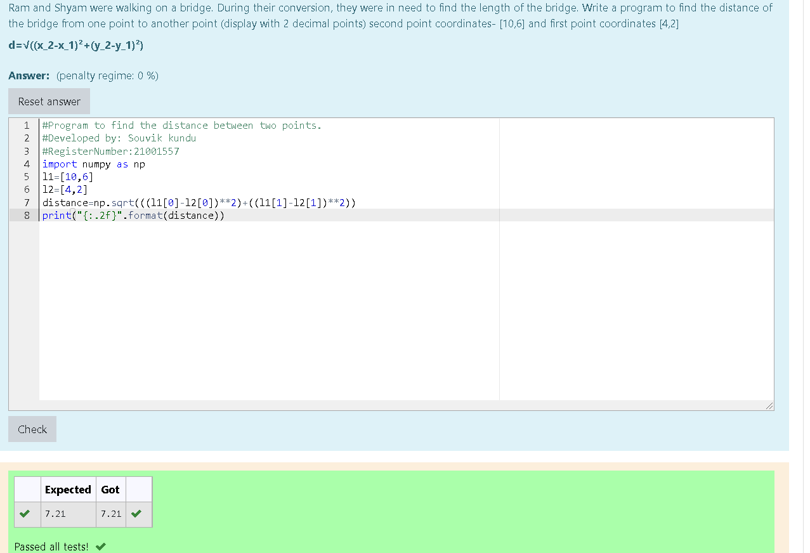

# DISTANCE-BETWEEN-TWO-POINTS

## AIM:
To write a python program to find the distance two 2 points
## ALGORITHM:
### Step 1:

Import the numpy module to use the built-in functions for calculation

### Step 2:

Get the input for list 1 and 2
 

### Step 3: 

Substitute the values in the distance formula  

### Step 4:

Print the distance

### Step 5:
End the program 

### PROGRAM:
~~~
#Program to find the distance between two points.
#Developed by: Souvik kundu
#RegisterNumber:21001557
import numpy as np
l1=[10,6]
l2=[4,2]
distance=np.sqrt(((l1[0]-l2[0])**2)+((l1[1]-l2[1])**2))
print("{:.2f}".format(distance))
~~~

### OUTPUT:

### RESULT:
Thus the distance between two points are successfully solved using python program
